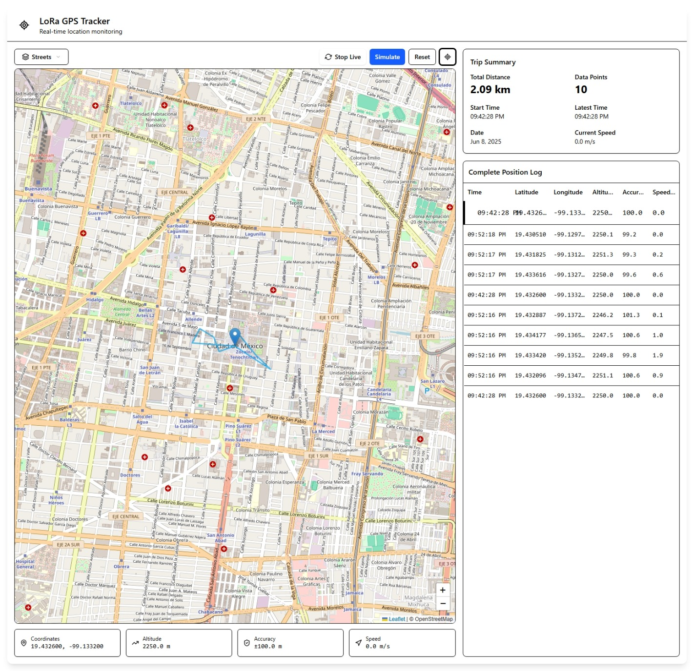
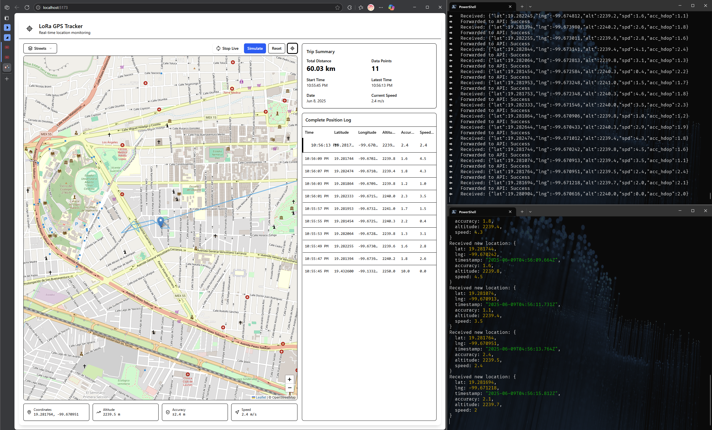

# 

<h1 align="center">
  
  
LoRa GPS Tracker

</h1>

Sistema de seguimiento GPS de largo alcance utilizando tecnología LoRa, diseñado para transmitir datos de ubicación a distancias de hasta 5km sin depender de redes celulares.

## ✨ Características

- Transmisión de datos hasta 5km en campo abierto
- Bajo consumo energético para mayor autonomía
- Utiliza banda ISM 433MHz (no requiere licencia)
- Sistema completo: dispositivo tracker + estación base receptora
- Interfaz para visualización de ubicaciones en tiempo real

## 🛠️ Hardware Requerido

- Módulo LoRa `SX1276` 433MHz
- Módulo GPS de bajo consumo `NEO-6M`
- `Arduino UNO` o `Arduino Nano` como microcontrolador

## 👥 Autores

- Fernando Bryan Reza Campos
- Karen Navarro Hurtado

## 🔌 Dashboard

## Prototipo Funcional

## 📚 Documentación

- [Marco Teórico](./resources/docs/00-marco-teorico.md)
- [Especificaciones Técnicas](./resources/docs/01-especificaciones-técnicas.md)

## Flujo de Datos

### Licence

This project is under the [MIT](./LICENSE) license.