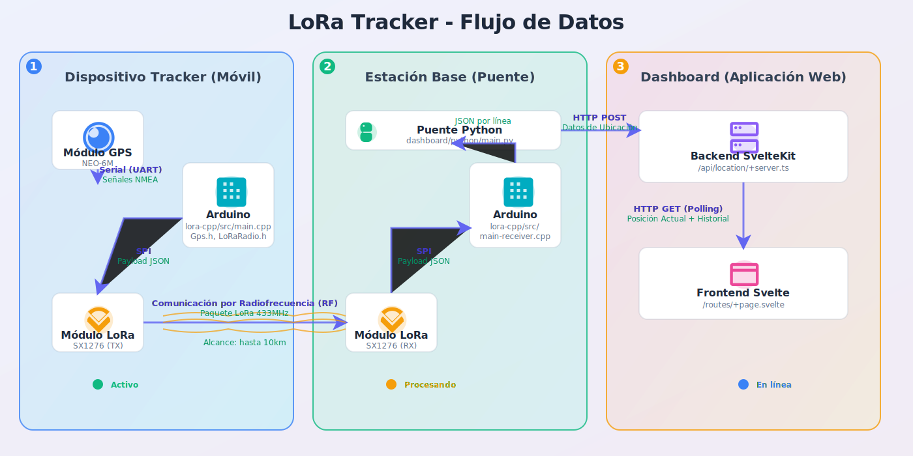

# Guía Técnica del Proyecto LoRa Tracker

## Introducción

Esta guía técnica proporciona un análisis detallado del funcionamiento interno del código fuente del proyecto LoRa Tracker. A diferencia del documento de especificaciones, que define el "qué", esta guía explica el "cómo", siguiendo el flujo de datos desde la captura en el dispositivo móvil hasta su visualización en el dashboard web.




## Dispositivo Tracker (El Transmisor)

El corazón del sistema de adquisición de datos. Su firmware está diseñado para ser eficiente y modular.

**Archivo Principal:** `lora-cpp/src/main.cpp`

### Inicialización y Configuración (`setup()`)

Al arrancar, el tracker configura todos sus periféricos y módulos de comunicación:
1.  **Inicialización de Módulos**: Se crean instancias de las clases personalizadas para cada componente de hardware: `Gps`, `LcdDisplay`, `EnvSensor` y, fundamentalmente, `LoRaRadio`.
2.  **Configuración de LoRa**: Se llama a `lora.begin()`, que configura los pines del microcontrolador (CS, RESET, IRQ) y establece la frecuencia de operación en 433MHz. Si esta inicialización falla, el programa se detiene para evitar un funcionamiento incorrecto.
3.  **Verificación de Componentes**: El firmware realiza una comprobación inicial de los módulos y muestra el estado en la pantalla LCD y en el monitor serie, asegurando que el dispositivo está listo para operar.

```
[snippet from lora-cpp/src/main.cpp - setup function]
```

### Bucle Principal y Adquisición de Datos (`loop()`)

El `loop()` está diseñado para operar de forma no bloqueante, utilizando `millis()` para gestionar el tiempo:
- **Lectura Continua de GPS**: En cada ciclo, se llama a `gps.processIncomingData()` para leer y procesar cualquier dato nuevo proveniente del módulo GPS.
- **Transmisión Periódica**: Un temporizador basado en `millis()` se asegura de que los datos se envíen a través de LoRa solo a intervalos definidos (`LORA_SEND_INTERVAL_MS`), conservando energía y respetando el ciclo de trabajo de la banda.

### Construcción y Envío del Paquete LoRa

Cuando el intervalo de tiempo para el envío se cumple:
1.  **Construcción del Payload**: Se crea una cadena de texto (string) en formato **JSON**. Este formato fue elegido por su flexibilidad y facilidad de parseo en el backend. La cadena contiene los datos de latitud, longitud y otros sensores.
2.  **Llamada a la Librería de Radio**: La cadena JSON se pasa como argumento al método `lora.sendData(payload)`.

```
[snippet from lora-cpp/src/main.cpp - payload construction]
```

Esta función, definida en nuestra librería `LoRaRadio`, se encarga de encapsular el payload JSON dentro de un paquete LoRa que incluye las direcciones de origen y destino, antes de transmitirlo por radiofrecuencia.

```
[snippet from lora-cpp/lib/LoRaRadio/src/LoRaRadio.cpp - sendData function]
```

## Estación Base (El Receptor y Puente)

La estación base tiene una doble función: recibir los datos inalámbricos y actuar como un puente hacia la aplicación web.

### Firmware del Receptor Arduino

**Archivo Principal:** `lora-cpp/src/main-receiver.cpp`

La lógica del receptor es deliberadamente simple y robusta:
1.  **Modo de Escucha**: El `loop()` del receptor llama continuamente a la función `lora.receiveData()`. Esta función pone al módulo LoRa en modo de recepción y comprueba si ha llegado un paquete válido dirigido a su dirección.
2.  **Validación y Extracción**: La función `receiveData()` se encarga de leer el paquete, verificar la dirección del destinatario y la integridad de la longitud del payload.
3.  **Puente a Serie**: Si se recibe un paquete válido, la carga útil (el payload JSON original) se extrae y se imprime directamente en el puerto serie (`Serial.println(payload)`). Este es el único y crucial trabajo del firmware receptor.

```
[snippet from lora-cpp/src/main-receiver.cpp - loop function]
```

### Puente Serie-Web (Python)

**Archivo Principal:** `dashboard/python/main.py`

Este script desacopla completamente el hardware del software web.
1.  **Escucha del Puerto Serie**: Utilizando la librería `pyserial`, el script abre y monitorea el puerto serie al que está conectado el Arduino receptor.
2.  **Lectura y Descodificación**: En un bucle infinito, lee los datos línea por línea. Cada línea corresponde a un paquete JSON completo recibido.
3.  **Petición HTTP**: Utilizando la librería `requests`, el script toma la cadena JSON y la envía mediante una petición `HTTP POST` al endpoint de la API del dashboard, completando así el puente.

```
[snippet from dashboard/python/main.py - main loop]
```

## Dashboard (Aplicación Web)

La capa final del sistema, donde los datos se procesan, almacenan y visualizan.

### Backend - API de SvelteKit

**Archivo Principal:** `dashboard/src/routes/api/location/+server.ts`

Este archivo define un endpoint de API con dos métodos:
- **`POST`**: Esta función es la que recibe la petición del puente de Python. Parsea el cuerpo JSON de la solicitud y actualiza una variable en memoria (`currentLocation`) con los nuevos datos de posición.
- **`GET`**: Esta función es llamada por el frontend. Responde con el objeto que contiene la ubicación actual y, si se solicita, el historial completo de posiciones. El almacenamiento es en memoria, lo que significa que se reinicia si el servidor se detiene.

```
[snippet from dashboard/src/routes/api/location/+server.ts - POST and GET handlers]
```

### Frontend - Interfaz de Usuario con Svelte

La interfaz de usuario es altamente reactiva gracias a Svelte 5 (Runes).

**Archivos Clave:**
- `dashboard/src/lib/stores/locationStore.svelte.ts`
- `dashboard/src/components/MapView.svelte`

1.  **Gestión de Estado Centralizada**: El archivo `locationStore` actúa como el "cerebro" del frontend. Es una clase que mantiene el estado de la aplicación (posición actual, historial, configuración del mapa).
2.  **Polling de Datos**: La tienda contiene un método `fetchLatestLocation()` que realiza una petición `GET` a la API. Este método es llamado periódicamente a través de un `setInterval`, implementando un mecanismo de polling para obtener actualizaciones.
3.  **Reactividad de la UI**: Los componentes de Svelte, como `MapView.svelte`, se "suscriben" a los datos del `locationStore`. Gracias a la reactividad de Svelte 5, cuando los datos en la tienda cambian (después de una petición GET exitosa), el componente del mapa se actualiza automáticamente. Un `$effect` se encarga de mover el marcador en el mapa de Leaflet a la nueva latitud y longitud sin necesidad de manipulación manual del DOM.

```
[snippet from dashboard/src/lib/stores/locationStore.svelte.ts - fetchLatestLocation function]
```

```
[snippet from dashboard/src/components/MapView.svelte - effect to update marker]
```
